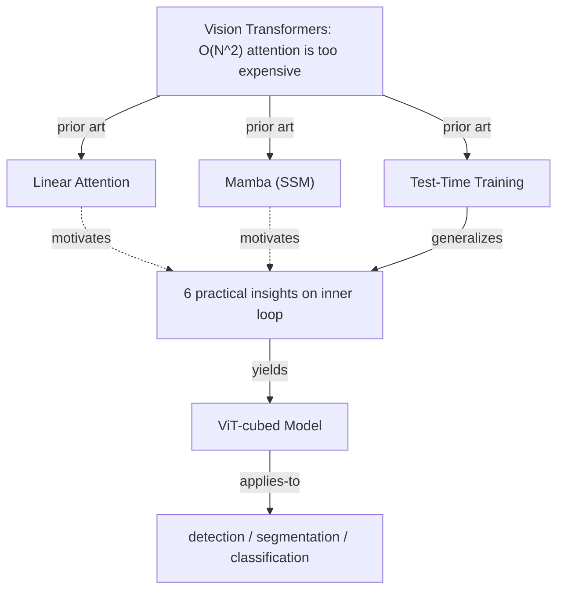
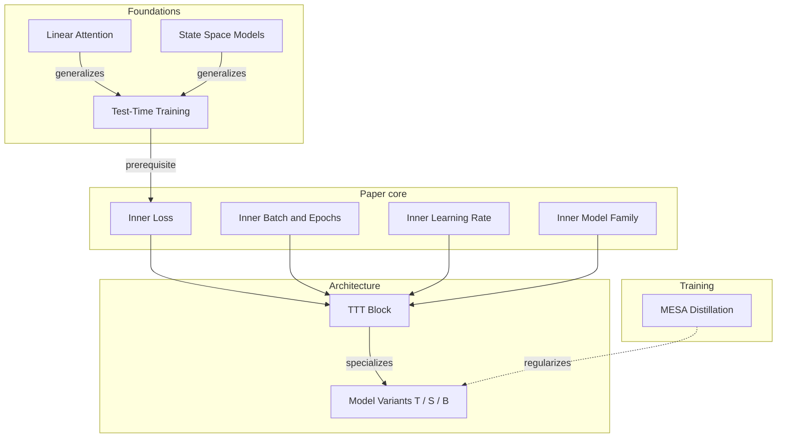
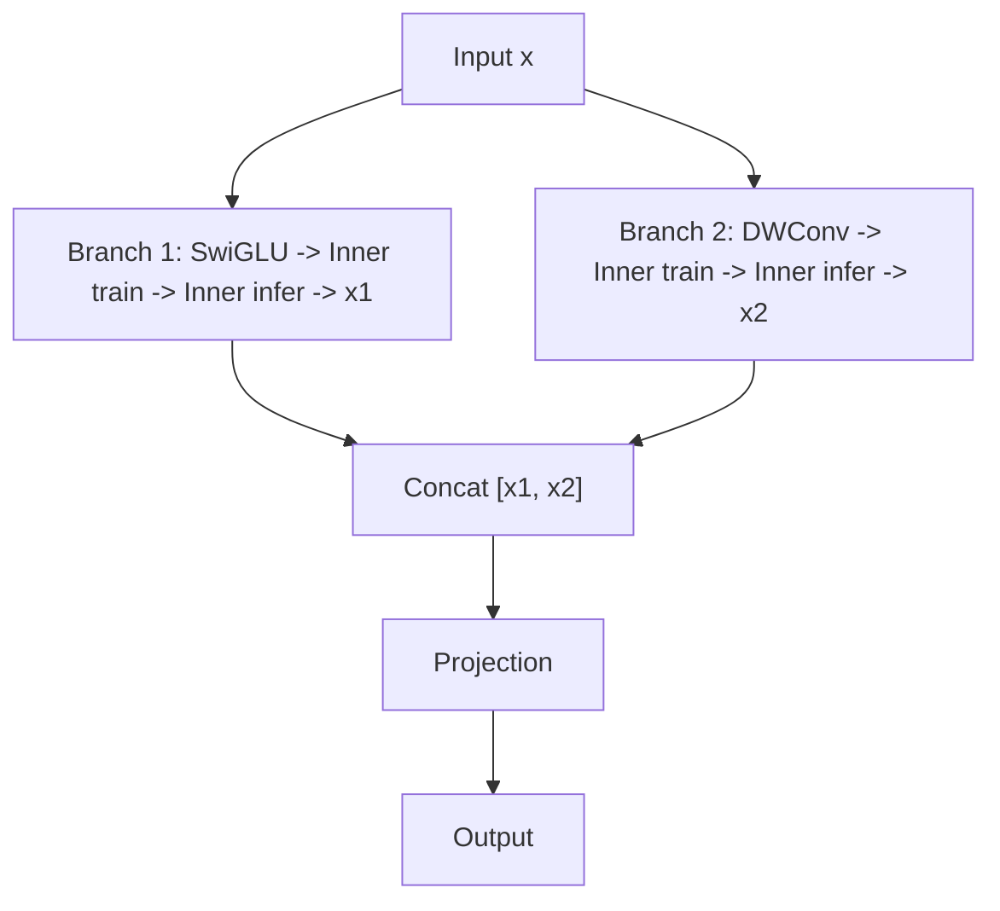
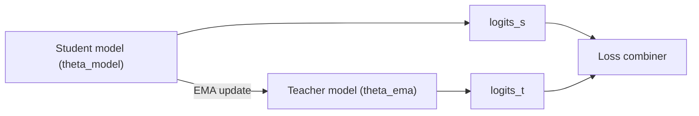

# Skill: Paper-to-Note (Concept Mind-Map)

> A repeatable methodology for converting a research paper into a structured study note.
> Reference output: `doc/study_note.md` (ViT³ paper — 21 sections, ~1100 lines)

---

## 1. What This Skill Produces

A single Markdown document that organizes **every key concept** in a paper as a mind-map.
Each concept is broken into four standard facets, cross-referenced with all other concepts,
and supplemented with derivations, tables, code pointers, and visual diagrams.

**Target audience**: the author's future self (or a collaborator) who wants to
understand the paper deeply, not just skim the abstract.

**Typical output**: 15–25 `##` sections, 800–1200 lines of Markdown.
The exact count depends on how many distinct concepts the paper introduces.

**Input**: either a pre-extracted Markdown file or a raw PDF. When the input is
a PDF, **Phase 0** (see §13) runs a MinerU + PyMuPDF extraction pipeline and
writes a permanent `<paper-slug>.md` archive (alongside `figs/<paper-slug>/`).
That archive — not the PDF — becomes the source for Phases 1–6. LLMs parse
Markdown far more reliably than PDF, so the archive is checked in and reused.

---

## 2. Document Skeleton

```
# {Paper Title} Study Note — A Concept Mind-Map

> Paper: {title} ({arXiv ID})
> Authors: {names}
> Affiliations: {institutions}

This note organizes every key concept in the paper as a mind-map.
Each concept is broken down into four facets:

- **Definition** — what it is, stated plainly
- **Properties** — its mathematical or behavioral characteristics
- **Application** — how the paper (or the field) uses it
- **Links** — connections to other concepts in this map

---

## 0. The Big Picture              ← Mermaid diagram: paper's core story arc

## 1–K. {Concept Sections}        ← 4-facet breakdown for each concept

## K+1. {Prior Art Comparison}     ← what existed, limitations, what this paper changes
## K+2. {Quick Reference Card}     ← insights/contributions summary table
## K+3. {Open Questions}           ← future work identified by the paper
## K+4. {Concept Dependency Graph} ← Mermaid diagram: how all concepts connect
## K+5. {Key Equations}            ← summary table of all equations
## K+6. {Reference Map}            ← citations grouped by topic
```

---

## 3. The 4-Facet Framework

Every concept section **must** include these four subsections:

### 3.1 Definition
- Plain-language explanation of what the concept is.
- Include the core equation with `$$...$$` LaTeX and `\tag{Eq.N}` numbering.
- If the concept has multiple variants, list them.

### 3.2 Properties
- Mathematical characteristics (complexity, capacity, constraints).
- Behavioral properties (when it works, when it fails).
- **Insights from the paper**: quote the paper's numbered insights verbatim,
  then explain the evidence (table data, figures).

### 3.3 Application
- How the paper uses this concept in its model.
- **Code references**: `file.py:line` format pointing to the implementation.
- Experimental results (reproduce key table rows).

### 3.4 Links
- Bullet list of connections to other concepts in the note.
- Format: `→ **{Concept Name}**: {relationship description}`
- Every link should be bidirectional — if A links to B, B should link back to A.

---

## 4. Special Subsections

Beyond the 4 facets, add these when applicable:

### 4.1 Derivation (inline)
- Use when one equation is derived from another within the same concept section.
- Format: `### Derivation: Eq.X → Eq.Y`
- Break into numbered steps: **Step 1**, **Step 2**, ...
- Each step: state what you do, show the result equation.
- Add explanatory blocks:
  - **Why {X} blocks this**: explain the mathematical obstacle.
  - **Complexity consequence**: before vs. after.
  - **Trade-off**: what is gained and lost.

Example from ViT³ note — inside §2 Linear Attention:
```markdown
### Derivation: Eq.1 → Eq.3

**Step 1.** Write Eq.1 for the i-th output token: ...
**Step 2.** Replace the Softmax kernel with a linear kernel: ...
**Step 3.** Factor Q_i out of the summation: → Eq.3

**Why Softmax blocks this**: Q_i is trapped inside exp(·)...
**Complexity consequence**: O(N²d) → O(Nd²)
**Trade-off**: speed gained, expressive power lost
```

### 4.2 Detailed Derivations (appendix-style)
- For lengthy proofs (e.g., loss function derivatives), create a sub-section
  under the relevant concept.
- Show each case separately with equation numbering: **(1)**, **(2)**, ...
- End with a **Summary pattern** table.

Example from ViT³ note — under §5.1 Inner Loss:
```markdown
#### Detailed Derivations (Appendix §8, Eq.8–17)

**(1) Dot Product Loss (Eq.8–9)**
  formula... derivative... conclusion.

**(2) MSE / L2 Loss (Eq.10–11)**
  formula... derivative... conclusion.

...

**Summary pattern**:
| Loss | ∂²L/∂V∂V̂ | Behavior | Top-1 |
|---|---|---|---|
| Dot Product | constant | ✓ | 78.9 |
| MAE | 0 (a.e.) | ✗ | 76.5 |
```

---

## 5. Section Types and Ordering

### 5.1 Section Ordering Strategy

Follow the paper's **logical dependency chain**, not the section numbers:

```
 1. Big Picture (§0)            — Mermaid diagram showing the paper's narrative arc
 2. Foundation concepts         — what the reader must know first
 3. Core paradigm               — the paper's main contribution
 4. Inner/Outer structure       — if the paper has nested loops or levels
 5. Design choices / Insights   — experimental findings that shaped the design
 6. Architecture details        — the final model, layer by layer
 7. Implementation details      — hand-derived backward, custom CUDA kernels, etc.
 8. Architecture variants       — model family (Tiny/Small/Base, flat/hierarchical)
 9. Downstream tasks            — detection, segmentation, generation, etc.
10. Training strategy           — special training recipes (MESA, distillation, etc.)
11. Efficiency analysis         — speed/memory comparisons
12. Prior Art comparison        — what existed before, limitations, what changed
13. Quick Reference Card        — insights summary table
14. Open Questions              — future work
15. Concept Dependency Graph    — Mermaid diagram of all connections
16. Key Equations               — summary table
17. Reference Map               — citations by topic
```

### 5.2 Grouping Rule
- If a concept has sub-concepts, make them sub-sections under one heading.
- Each sub-section still uses the 4-facet framework where applicable.

```
## 5. Inner Training Configuration
### 5.1 Inner Loss Function        ← 4-facet + derivation appendix
### 5.2 Inner Batch Size and Epochs ← 4-facet
### 5.3 Inner Learning Rate         ← 4-facet

## 6. Inner Model Design
### 6.1 Scaling Width               ← Properties + Links
### 6.2 Scaling Depth               ← Properties + Links
### 6.3 Convolution as Inner Model  ← 4-facet
```

### 5.3 Section Types Beyond 4-Facet Concepts

Some sections follow different formats. Recognize and apply these:

**a) Architecture Flow Section** (e.g., "The TTT Block — Putting It All Together")
- Definition: what the block does, inputs/outputs
- Architecture diagram (Mermaid `flowchart` preferred; ASCII fallback for dense multi-branch layouts — see §7.3)
- Properties: shape-preserving, complexity, parallelizability
- Application: code reference to the full class

**b) Downstream Task Sections** (e.g., "Object Detection", "Semantic Segmentation")
- **Setup**: framework (Mask R-CNN, UPerNet) + backbone + schedule
- **Key result**: one focused table + one-sentence interpretation
- Keep these concise — they demonstrate generality, not dive deep

**c) Training Strategy Section** (e.g., "MESA")
- Definition + How it works (Mermaid `flowchart LR` preferred; ASCII fallback for dense parallel paths — see §7.4)
- Properties: overhead, improvement magnitude
- Application: config values + code locations

**d) Prior Art Comparison Section** (see §6 below for full specification)

**e) Quick Reference Card**
- Single summary table: `| # | Insight | Design Choice | Evidence |`
- One row per key finding

**f) Efficiency Analysis**
- Definition: what is being compared
- Key data points: speedup, memory reduction at specific resolutions
- Keep brief — this is a reference section

---

## 6. The Prior Art Comparison Section

This section is critical and was not obvious at first. Every paper positions itself
against existing work, and the note should capture this positioning clearly.

### Structure (4 subsections)

```markdown
## K+1. What Existed Before and What This Paper Changes

### K+1.1 Prior Approaches and Their Limitations
- For each major prior approach (3–5 approaches):
  - What it is (1 sentence)
  - What it does well (1 sentence)
  - Where it falls short (2–3 sentences with specific evidence)
- Write in narrative paragraphs, not bullet lists — this section tells a story.

### K+1.2 What This Paper Contributes
- Number each contribution explicitly (Contribution 1, 2, 3).
- For each: what gap it fills, what it found/built, why it matters.
- Include tables where appropriate (e.g., "What they tested | What they found | Why it matters").

### K+1.3 Side-by-Side: Prior Art vs. This Paper
- One table comparing all approaches on key dimensions:
  | Dimension | Approach A | Approach B | This Paper |
- One table comparing this paper with its closest predecessor:
  | Dimension | Predecessor | This Paper |

### K+1.4 The Core Shift in Thinking
- 2–3 paragraphs explaining the fundamental conceptual change.
- Not a list of improvements — a narrative about what changed and why it matters.
```

### Writing Style for This Section
- **No LLM filler words**: avoid "notably", "importantly", "it is worth noting",
  "furthermore", "comprehensive", "robust", "leverages", "facilitates".
- **Lead with specifics**: "Linear Attention compresses context into a d×d matrix"
  not "Linear Attention offers an efficient alternative".
- **Name the limitation precisely**: "the d×d linear state is too small"
  not "it has limited capacity".

---

## 7. Visual Elements

### 7.0 Mermaid Conventions

Mermaid is the **default** rendering language for graph-style diagrams in this
skill — Big Picture (§7.1), Concept Dependency Graph (§7.2), Architecture
Diagrams (§7.3), Training Flow Diagrams (§7.4). Rules inherited from the
textbook-to-note skill keep diagrams readable across Obsidian, VSCode, GitHub,
and claude.ai:

- **Standard relation labels (6 only)** — do not invent new ones:

  | Label | Meaning | Example |
  |---|---|---|
  | `prerequisite` | A must be understood before B | inner product → Fourier series |
  | `generalizes` | A subsumes B | Transformer generalizes linear attention |
  | `specializes` | A is B with added constraints | ViT is a specialized Transformer |
  | `is-a` | Definitional / property relation | Parseval is-a FT property |
  | `applies-to` | A is used for B | FFT applies-to heat equation |
  | `dual-to` | Bijective / adjoint pair (use dotted `-.->`) | time ↔ frequency |

- **Node cap ≤ 12 per diagram**. Exceed → split into `subgraph` blocks. For
  the Concept Dependency Graph (§7.2) covering 15–25 concepts this is always
  required.
- **Labels are plain text only**. No LaTeX (`$...$`), no Unicode math glyphs
  (`∑`, `α`, `ψ`, `²`, `→`). Spell them out: write
  `"sum of f_j times exp(-i 2 pi jk/n)"` instead of `$\sum f_j e^{-i 2\pi jk/n}$`.
  Mermaid renderers disagree on math rendering, and LaTeX inside node text
  frequently breaks the parser entirely.
- **Cross-links use dotted arrows `-.->`**. These surface Novak-style "insight"
  connections between otherwise separate branches — a key signal that the
  graph is more than a tree.
- **Hierarchy**: general → specific. Use `graph TD` (top-down) for
  dependency/narrative arcs and `graph LR` (left-right) for pipelines and
  training flows.

### 7.1 Big Picture (§0)

Shows the paper's high-level story arc: problem → prior approaches → this
paper's solution → applications. Default: Mermaid `graph TD`.

Example (ViT³ narrative arc):

````markdown

````

**ASCII fallback**: use only when the narrative requires overlapping annotations
or timeline layout that Mermaid cannot express. State the reason inline
(`<!-- ASCII used because ... -->`).

### 7.2 Concept Dependency Graph (§K+4)

Shows how **all** concepts in the note connect. Think of it as "a table of
contents with relationships." Default: Mermaid `graph TD` with `subgraph`
blocks (the 15–25 paper concepts always exceed the 12-node cap).

Example:

````markdown

````

Every concept section (§1..K) should appear as a node, and every bidirectional
Link in the Links facets should appear as an arrow (the graph is the visual
audit for link completeness).

### 7.3 Architecture Diagrams

For model architectures, **Mermaid `flowchart TD` or `flowchart LR` is preferred**
when the graph has ≤ 12 nodes and ≤ 3 branching paths. For denser layouts —
many parallel branches, multiple skip connections, multi-head fan-out, or tight
column alignment requirements — **fall back to ASCII** (Mermaid auto-layout
typically clutters these cases).

**Mermaid example** (simple 2-branch TTT-like block):

````markdown

````

**ASCII fallback example** (when branching/annotations are too dense):

```
Input x
  │
  ├── Branch 1 (SwiGLU)
  │     │
  │    Inner train → Inner infer → x1
  │
  ├── Branch 2 (DWConv)
  │     │
  │    Inner train → Inner infer → x2
  │
  └──→ Concat [x1, x2] → Proj → Output
```

**Choose Mermaid when**: simple data flow, labeled edges matter, < 12 nodes.
**Choose ASCII when**: > 12 nodes, multiple skip connections crossing each
other, or tight visual alignment across branches is needed.

### 7.4 Training Flow Diagrams

For training strategies (distillation, EMA, student-teacher), **Mermaid
`flowchart LR` is preferred**. Put the loss / update equation in a Markdown
block **below** the diagram, not inside node labels (Mermaid's LaTeX support
is inconsistent across renderers).

**Mermaid example** (MESA-style student-teacher):

````markdown

````

Companion equation (outside the diagram):
$$L = (1 - r)\,\mathrm{CE}(\mathrm{logits}_s, \text{label}) + r\,\mathrm{KL}(\mathrm{logits}_s, \mathrm{logits}_t)$$

**ASCII fallback** applies under the same criteria as §7.3 (many parallel
paths, dense annotations, or tight alignment needs).

---

## 8. Tables

### 8.1 Experimental Results
- Reproduce key tables from the paper.
- Use Markdown table syntax with alignment.
- **Bold** the paper's chosen design / best result.
- Include column headers: Model | Params | FLOPs | Metric.
- Include ALL model scales reported in the paper (Tiny, Small, Base),
  not just the smallest — the scaling story matters.

### 8.2 Comparison Tables (Design Choices)
- Format: Choice | Config | Result.
- Show the trade-off clearly.
- Include all rows from the paper — missing rows lose information.

### 8.3 Summary Tables
- For insights or equation collections, create compact reference tables.
- Example: `| # | Insight | Design Choice | Evidence |`

### 8.4 Side-by-Side Comparison Tables
- For Prior Art section: Dimension | Method A | Method B | This Paper
- Keep dimensions to 5–8 rows for readability.

---

## 9. Equations

- Use `$$...\tag{Eq.N}$$` for display equations with paper's numbering.
- Use `$...$` for inline math.
- When the paper's equation numbering is referenced elsewhere, keep it consistent.
- For derived quantities not in the paper, use descriptive names instead of numbers.
- For appendix equations, use the paper's appendix numbering (e.g., Eq.8–17).

---

## 10. Code References

- Format: `file.py:line` or `file.py:start-end`.
- Place in the **Application** subsection.
- Map paper concepts to exact code locations:
  ```
  - In code: `ttt_block.py:40-41` — self.w1 and self.w2 are the two weight matrices.
  - Inner training: `ttt_block.py:54-88` — hand-derived forward/backward.
  ```
- When a concept spans multiple code files, list all locations.
- For config values, reference both the yaml file and the code that reads it:
  ```
  - MESA ratio: `h_vittt_t_mesa.yaml:6` — `MESA_RATIO: 1.0`
  - EMA model creation: `main_ema.py:63` — `ModelEma(model, decay=0.9996)`
  ```

---

## 11. Cross-References (Links)

Every concept's **Links** subsection uses this format:

```markdown
### Links
- → **{Target Concept}**: {how this concept relates to the target}
- → **{Another Concept}** [{citation}]: {relationship}
```

Rules:
1. Every link must describe the **relationship**, not just name the target.
2. Use verbs: "is obtained by", "generalizes", "is a special case of", "replaces".
3. If concept A links to B, concept B should link back to A.
4. Include paper citation numbers `[N]` when referencing external work.

---

## 12. Language and Style

### 12.1 General Rules
- **Language**: English (default). Consistent throughout — do not mix languages.
- **Tone**: Technical but accessible. Define jargon on first use.
- **Conciseness**: Lead with the key point, then elaborate. No filler.
- **Emphasis**: Use `**bold**` for key terms, `*italic*` for nuance/emphasis.
- **Section separators**: Use `---` between every `##` section.

### 12.2 Words to Avoid (LLM-style writing)
These words signal machine-generated text. Replace them with specific, concrete language:

| Avoid | Use Instead |
|---|---|
| notably, importantly, interestingly | (just state the fact) |
| comprehensive, robust, holistic | (describe what it actually covers) |
| leverages, facilitates, utilizes | uses, applies, enables |
| it is worth noting that | (delete — start with the content) |
| furthermore, moreover, additionally | (start new sentence or use "also") |
| in this context | (delete or specify the context) |
| demonstrates, showcases | shows, achieves |
| a novel approach | (describe what makes it new) |

### 12.3 How to Write the Prior Art Section
The Prior Art section (§6 above) deserves special attention because it is
the section most prone to vague, filler-heavy writing.

Good:
> Linear Attention compresses the entire context into a single d×d matrix W = K^T V.
> That is too small a bottle for the information to pass through.

Bad:
> Linear Attention notably offers a more efficient alternative by leveraging
> a comprehensive compression strategy, though it demonstrates limitations
> in terms of capacity.

The difference: the good version names the specific object (d×d matrix),
the specific operation (compresses), and the specific problem (too small).
The bad version hides behind abstract nouns and filler adjectives.

---

## 13. Process: How to Build the Note

### Phase 0: PDF → Markdown Extraction (only if input is a PDF)

If the input is a PDF rather than pre-extracted Markdown, run this phase first.
The extracted Markdown is saved as `<paper-slug>.md` in the working directory
and **kept permanently** — LLMs parse Markdown more reliably than PDF, so the
archive is reused for Phases 1–6 and for any future re-reading of the paper.

`<paper-slug>` = the PDF stem with spaces → `_`, special characters stripped,
lowercased. Example: `ViT-cubed_Bai_2025.pdf` → `vit_cubed_bai_2025`.

**Output layout** (relative to the working directory):
```
<paper-slug>.md            ← the permanent verbatim archive (Phase 1 input)
figs/<paper-slug>/         ← extracted and recropped figures at 300 DPI
    figure_1.jpg
    figure_2.jpg
    ...
```

The study note produced by Phases 1–6 is a **separate file** (e.g.,
`study_note.md` or user-chosen name); the Phase 0 archive is not overwritten.

#### Step 0.1: Environment (conda + MinerU + PyMuPDF)

Detect OS, activate the `ClaudeCode` conda environment (create with Python 3.11
if missing), and install `mineru[all] pymupdf pillow` via `uv pip install -U`.
First run downloads MinerU model weights (~several GB); subsequent runs are
offline.

```bash
OS_TYPE="$(uname -s 2>/dev/null || echo Windows)"
case "$OS_TYPE" in
    Linux*|Darwin*)
        CONDA_ACTIVATE="source $(conda info --base)/etc/profile.d/conda.sh && conda activate"
        ;;
    *) CONDA_ACTIVATE="conda activate" ;;
esac
if ! conda env list | grep -q "ClaudeCode"; then
    conda create -n ClaudeCode python=3.11 -y
fi
$CONDA_ACTIVATE ClaudeCode && uv pip install -U "mineru[all]" pymupdf pillow -q
```

#### Step 0.2: MinerU Extraction

```bash
WORKDIR="$(mktemp -d -t paper_to_note_XXXXXX)"
$CONDA_ACTIVATE ClaudeCode && \
  mineru -p "<pdf-path>" -o "$WORKDIR/mineru" -b pipeline
```

- No `--page-ranges` argument: the paper is processed whole.
- Outputs `${WORKDIR}/mineru/<pdf-stem>/auto/<pdf-stem>.md` (main markdown),
  `_content_list.json` (flat reading-order list with bbox), and `images/*.jpg`.

#### Step 0.3: Figure Recrop (PyMuPDF caption-cluster)

MinerU occasionally misses subplot figures or crops only one panel of a
multi-panel layout. Re-crop using caption-based cluster expansion.

- **Caption regex**: `^\s*Figure\s+(\d+):` (flat numbering; no chapter prefix).
- **Algorithm**: for each page containing a "Figure N:" caption, seed a
  bounding-box cluster from the caption and expand upward. Include drawings,
  images, and short text blocks within `GAP_TOL = 20pt`. Reject expansion steps
  that would cross a **body-text barrier** (block with length ≥ 200 chars AND
  ≥ 3 lines AND width > 300pt AND avg line length > 45 chars) or the
  running-header clip.
- **Parameters**: `DPI = 300`, `PADDING = 4pt`, header clip ≥ 78pt.
- **Output**: `figs/<paper-slug>/figure_<N>.jpg`.

When auto-crop fails on unusual layouts, fall back to manual bbox:

```python
import fitz
clip = fitz.Rect(x0, y0, x1, y1)
pix = doc[pidx].get_pixmap(matrix=fitz.Matrix(300/72, 300/72), clip=clip, alpha=False)
pix.save(f"figs/<paper-slug>/figure_{N}.jpg")
```

Record metadata in `${WORKDIR}/figures.json` for the assembly step:
```json
[{"number": "1", "caption": "...", "pdf_page": 3,
  "bbox": [x0, y0, x1, y1], "path": "figs/<paper-slug>/figure_1.jpg"}]
```

#### Step 0.4: Reference Section Parsing

Papers carry their own References at the end — no shared bibliography cache.

1. Locate the "References" / "Bibliography" heading in the trailing pages via
   `page.get_text("text")`.
2. Parse entries with a regex appropriate to the citation style:
   - **Numeric** (`[N]` style): `^\[(\d+)\]\s+(.+?)(?=^\[\d+\]|\Z)` (multiline).
   - **Author-year**: `^([A-Z][^()]+\(\d{4}\))\s+(.+?)(?=^[A-Z]|\Z)`.
3. Save to `${WORKDIR}/refs.json` keyed by citation number or short author-year
   label.

#### Step 0.5: Claude Assembly

Read MinerU's raw `<pdf-stem>.md` and `_content_list.json`. Produce
`<paper-slug>.md` with the following rules:

1. **Preserve prose verbatim**. No paraphrase at this stage — this file is a
   faithful archive. Interpretation happens in Phases 1–6.
2. **Preserve equations** with `$$...\tag{Eq.N}$$` using the paper's own
   numbering. Keep `\underbrace`, `\overbrace`, and piecewise `\begin{cases}`
   constructs as-is.
3. **Preserve code listings** in fenced blocks with language tags
   (```python, ```matlab, etc.).
4. **Preserve tables** by converting MinerU's HTML to Markdown; keep as HTML
   when the table contains heavy math.
5. **Filter noise** via regex:
   - Running headers (paper title, author line, venue name) on first line of
     each page.
   - Standalone page numbers (`^\d{1,3}\s*$`).
   - arXiv ID / DOI footer strips.
6. **Insert figures at first body reference**:
   ```markdown
   
   > **Figure N** <original caption verbatim>
   > *(Source: <first author> et al., <year>, arXiv:<id-if-available>)*
   ```
7. **Append `## References`** from `refs.json` at the end, one entry per line:
   `- **[N]** <entry text>`.
8. Delete `$WORKDIR` after the archive is written.

After Phase 0 you have `<paper-slug>.md` and `figs/<paper-slug>/`.
Proceed to Phase 1 using `<paper-slug>.md` as input.

### Phase 1: Read and Inventory (paper → concept list)

> If you started from PDF, the input for this phase is the `<paper-slug>.md`
> archive produced by Phase 0, not the PDF itself.

1. Read the paper end-to-end. Do not write anything yet.
2. List every distinct concept. A "concept" = something that has its own definition
   and properties. Typical count: 10–20 for a methods paper.
3. Identify the dependency chain: which concepts build on which.
4. **Inventory all artifacts**: create a checklist of every equation, table, figure,
   remark/insight, and algorithm in the paper.

Example inventory:
```
Equations: Eq.1–7 (main), Eq.8–17 (appendix)
Tables: Tab.1–13
Figures: Fig.1–4
Insights: 1–6
Remarks: 1–6
```

### Phase 2: Build the Skeleton
1. Create §0 Big Picture as a Mermaid diagram (see §7.1).
2. Order concepts by dependency (foundations first).
3. Create empty sections with the 4-facet headers.
4. Decide grouping: which concepts become sub-sections of a parent.
5. Add placeholder sections for Prior Art, Quick Reference, Dependency Graph,
   Key Equations, and Reference Map.

### Phase 3: Fill Each Section (iterative)
1. Write **Definition** first — ground the concept.
2. Write **Properties** — what makes it tick mathematically.
3. Write **Application** — where and how it appears in practice.
4. Write **Links** — connect to everything else.
5. Add **Derivation** subsections where equations connect.
6. For each section, check off which artifacts (equations, tables, remarks) it covers.

### Phase 4: Add Meta-Sections
1. Write the **Prior Art Comparison** (§6 structure above).
2. Create the **Concept Dependency Graph** as a Mermaid diagram with `subgraph` blocks (see §7.2).
3. Create the **Key Equations** table.
4. Create the **Reference Map** (citations grouped by topic).
5. Create the **Quick Reference Card** (insights summary table).
6. Add **Open Questions** from the paper's conclusion.

### Phase 5: Verify Coverage
This is the most important phase. Without it, gaps accumulate silently.

1. **Equation check**: walk through the inventory. Every equation should appear
   in at least one section with correct numbering.
2. **Table check**: every table from the paper should be reproduced or summarized.
   Include all model scales (Tiny/Small/Base), not just one.
3. **Remark/Insight check**: every numbered insight or remark should appear,
   either as a quoted block or integrated into Properties.
4. **Figure check**: key figures from the paper should be described in prose
   or redrawn as Mermaid diagrams (ASCII fallback permitted for dense
   architectures per §7.3). Bar charts and line plots can be described in
   words; architecture diagrams should be redrawn (Mermaid preferred).
5. **Cross-reference check**: for every link A→B, verify B→A exists.
6. **Language consistency**: scan for mixed languages, LLM filler words,
   inconsistent terminology.

### Phase 6: Iterate
Real note-building is not linear. Expect to:
- Discover missing concepts while writing Links (a concept is referenced but has no section).
- Reorganize sections when the dependency chain becomes clearer.
- Expand a Properties subsection when the derivation reveals more than expected.
- Merge or split sections as the right granularity becomes apparent.

The note is done when the Phase 5 checklist passes cleanly.

---

## 14. Coverage Verification Method

When verifying that a study note covers the full paper, use this systematic approach:

### Step 0: Verify Phase 0 Archive (when started from PDF)
Before inventorying concepts, confirm the `<paper-slug>.md` archive faithfully
represents the source PDF:
- **Equation count**: grep for `\\tag{` and compare against the PDF's equation
  numbering. Missing tags usually mean MinerU dropped an equation or merged it.
- **Figure count**: `ls figs/<paper-slug>/ | wc -l` should match the number of
  captions in the PDF.
- **Reference count**: entries under `## References` should cover every `[N]`
  cited in the body. Use a quick set-diff to spot gaps.
- **Noise scan**: grep for running-header patterns, page-number-only lines,
  and arXiv/DOI footer strings. Zero hits expected.

If any of these fail, fix the Phase 0 output before starting Phase 1 — the
study note inherits every defect of the archive.

### Step 1: Build a Source Inventory
From the paper (PDF or markdown), list:
- All equations with their numbers
- All tables with their numbers and what they show
- All numbered insights, remarks, or theorems
- All figures and what they illustrate

### Step 2: Cross-reference Against the Note
For each item in the inventory, find where it appears in the study note.
Mark each as:
- **Complete**: fully reproduced with all rows/columns
- **Partial**: present but abbreviated (e.g., only Tiny scale from a Tiny/Small/Base table)
- **Missing**: not found anywhere in the note

### Step 3: Prioritize Gaps
Not all gaps are equal. Priority order:
1. **Missing equations** — these are the paper's core language
2. **Missing insights/remarks** — these are the paper's claimed contributions
3. **Abbreviated tables** — especially classification/benchmark tables where the scaling story matters
4. **Missing figure descriptions** — especially architecture figures
5. **Missing training protocol details** — optimizer, schedule, augmentation

---

## 15. Adapting This Skill to a New Paper

When given a new paper, follow these steps:

### Step 1: Identify the Paper's Type
Different paper types emphasize different section types:

| Paper Type | Heavy Sections | Light Sections |
|---|---|---|
| Methods paper (new architecture) | Architecture, Design Choices, Ablations | Theory |
| Theory paper (new loss/objective) | Derivations, Proofs | Architecture, Downstream |
| Systems paper (efficiency) | Efficiency, Engineering | Novel concepts |
| Empirical paper (benchmark) | Results Tables, Comparisons | Derivations |

### Step 2: Adjust Section Ordering
The ordering in §5.1 is a template. Adapt it:
- If the paper has no nested inner/outer structure, skip that section type.
- If the paper has no code, skip code references (but still note where code would go).
- If the paper introduces a novel training recipe, give it a full section.
- If the paper's main contribution is empirical, the results sections should be more detailed.

### Step 3: Calibrate Depth
- **Core contribution sections**: 4-facet + derivations + detailed tables. Go deep.
- **Context sections** (prior art, related work): narrative + comparison tables. Medium depth.
- **Application sections** (downstream tasks): Setup + Key result. Keep brief.
- **Meta sections** (dependency graph, equations table, reference map): formulaic, just fill them in.

### Step 4: Handle Papers Without Code
If no code repository is available:
- Replace the Application → Code References pattern with
  Application → Implementation Notes (how you would implement it).
- Or leave the code reference slots empty with a `TODO: map to code` marker.

---

## 16. Checklist

Before considering the note complete, verify:

**Phase 0 archive (only if started from a PDF)**
- [ ] `<paper-slug>.md` archive exists and is prose-verbatim against the PDF
- [ ] `figs/<paper-slug>/` contains one JPG per paper figure at 300 DPI
- [ ] Every `\tag{Eq.N}` in the archive matches the PDF's equation numbering
- [ ] `## References` in the archive covers every `[N]` cited in the body
- [ ] Noise filtered: zero running headers, standalone page numbers, or arXiv/DOI footer lines

**Study note (produced by Phases 1–6)**
- [ ] §0 Big Picture is a Mermaid diagram (ASCII fallback only when Mermaid cannot express the arc — reason noted inline)
- [ ] Every concept has all 4 facets (Definition, Properties, Application, Links)
- [ ] All paper equations are included with correct numbering
- [ ] Derivations show step-by-step reasoning
- [ ] Key tables from the paper are reproduced with all model scales
- [ ] Code references use `file:line` format (if code is available)
- [ ] Cross-references are bidirectional
- [ ] Prior Art section compares approaches with specific limitations
- [ ] Quick Reference Card summarizes key insights
- [ ] Concept Dependency Graph is a Mermaid diagram with `subgraph` blocks and covers every concept section; every Links arrow appears as a graph edge
- [ ] Mermaid conventions (§7.0) followed: ≤ 12 nodes per graph/subgraph, 6 standard relation labels only, plain-text labels (no LaTeX / Unicode math glyphs), cross-links as `-.->`
- [ ] Architecture & Training Flow diagrams use Mermaid when ≤ 12 nodes and ≤ 3 branches; ASCII fallback only for dense layouts
- [ ] Key Equations summary table is complete
- [ ] Reference Map groups all citations by topic
- [ ] Language is consistent throughout (no mixed languages, no LLM filler)
- [ ] No concept is mentioned without being defined in its own section
- [ ] Coverage verification (§14) has been performed against the source paper
